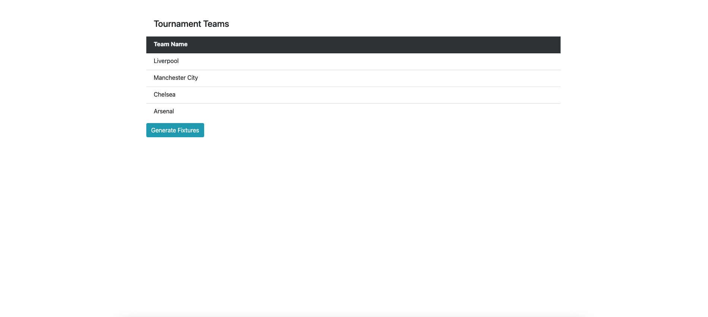

# Premiere League Simulation

## Tech Stack

* PHP (version: 8.0)
* Laravel (version: 8.5)
* MySQL (version: 8.0) (Persistent Storage)
* Nginx
* Docker, Docker Compose

## Installation

**Note:** If you do not have docker daemon, install and run before.

1. Clone the repo

```shell
git clone https://github.com/akcauser/Premiere-League-Simulation.git
```

2. Change directory to `Premiere-League-Simulation`

```shell
cd Premiere-League-Simulation
```

3. Copy `.env.example` file as `.env` and add your environment variables

```shell
cp .env.example .env
```

4. Install vendor

```shell
composer install
```

5. Generate app key

```shell
php artisan key:generate
```

6. Build And Run Docker Containers

```shell
docker-compose up -d
```

6. Enter to app container

```shell
docker exec -it premiere-league-simulation_app_1 bash
```

7. Migrate and seed database in container.

```shell
php artisan migrate:fresh --seed
```

8. Open welcome page `http://localhost:8080`



# Contributing Guide

* [Check Contributing Guide](./CONTRIBUTING.md).
